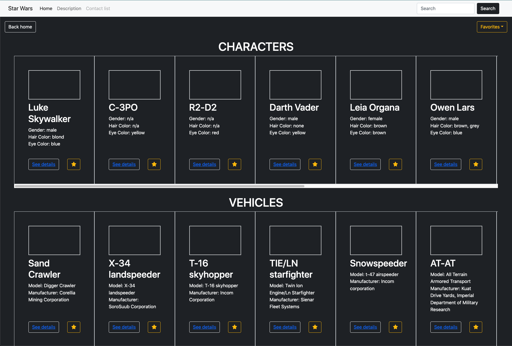

# Star Wars Reading List 🌌

*A minimalist version of the Star Wars Databank — with favorites, random exploration, and search!*

Built with **React**, **Bootstrap**, and **SWAPI.tech**, this app lets users explore Star Wars characters, vehicles, and planets with ease, and save their favorites with persistent state.



## Features

- Browse Star Wars characters, vehicles, and planets
- View detailed information for each entity
- Add/remove items to/from your favorites list
- Responsive design with Bootstrap components

## Technologies used

- [React.js](https://reactjs.org/)
- [Bootstrap 5](https://getbootstrap.com/)
- [React Router](https://reactrouter.com/)
- [SWAPI.tech](https://www.swapi.tech/)
- Context API for global state
- localStorage for persistence

## 🛠 Installation

1. Clone this repo:
```bash
git clone https://github.com/luisoballos/star-wars-reading-list.git
```

2. Install dependencies:
``` bash
npm install
```

3. Run the development server:
``` bash
npm run dev
```

## Project structure
``` bash
├── components/
│   ├── Navbar.jsx
│   ├── Card.jsx
│   └── Footer.jsx
├── pages/
│   ├── Home.jsx
│   ├── Description.jsx
│   ├── Favorites.jsx
│   └── ErrorPage.jsx
```

## API usage
This project uses the [SWAPI.tech](https://www.swapi.tech/documentation) API to fetch Star Wars data. Images are sourced from [Star Wars Databank](https://www.starwars.com/databank).

## To-do
- Add images to cards.
- Add search bar functionality.
- Add local storage.

## Contributing
Contributions are welcome! Please fork the repository and submit a pull request.

## License
Made with ❤️ by Luis Oballos as part of the 4Geeks Academy Coding Bootcamp.